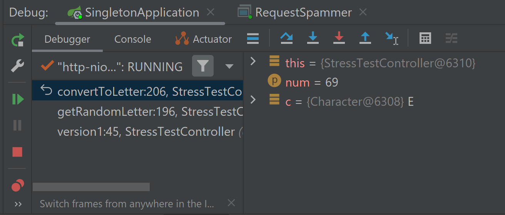

# Singletons, Threads, and the Call Stack in Spring Boot

### Part 1: The Call Stack

1. Place a breakpoint on the last line of `StressTestController.convertToLetter` (the one with the return statement).
2. Start Spring Boot by running `SingletonApplication` in debug mode.
3. Start `RequestSpammer` in debug mode.
4. At the first prompt, type `1` to run version 1.
5. At the second prompt, type `1` to send a single request.

In the debug panel, you are now paused during execution of the `convertToLetter` method.
On the left side of the debug panel, notice the chain of method calls that led to where
you are paused: the *call stack*. Each entry in the call stack is a *stack frame*.

In the center panel, you can see the variables that are available to each stack frame.

### Part 2: Singleton Beans

1. Remove any breakpoints and start both applications as above.
2. Run version 1 with 1 request. Looks fine, right?
3. Run version 1 with 1 request again. Hey, it's the string from before, but with 10 extra letters!
